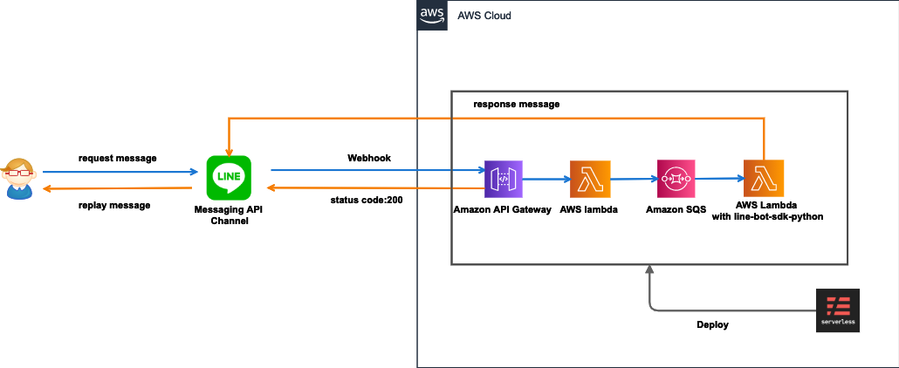

# line-bot-sls-template

## 概要
LINE Bot で使用する Messaging API の AWS 実行環境を serverless framework でデプロイできるテンプレート。

## 環境
- python 3.8
- Pipenv version 2018.11.26
- serverless framework 2.15.0

## 構成


## 環境変数
- serverless.yml 
    - LINE_CHANNEL_SECRET: LINE MessagingAPI アカウントのLシークレット
    - LINE_CHANNEL_ACCESS_TOKEN: LINE MessagingAPI アカウントのアクセストークン

## 使い方
### 必要ライブラリインストール
```
npm install
pipenv install
```

### 実装
bot_execute.py にロジックを実装

### デプロイ

```
npx serverless deploy
```
